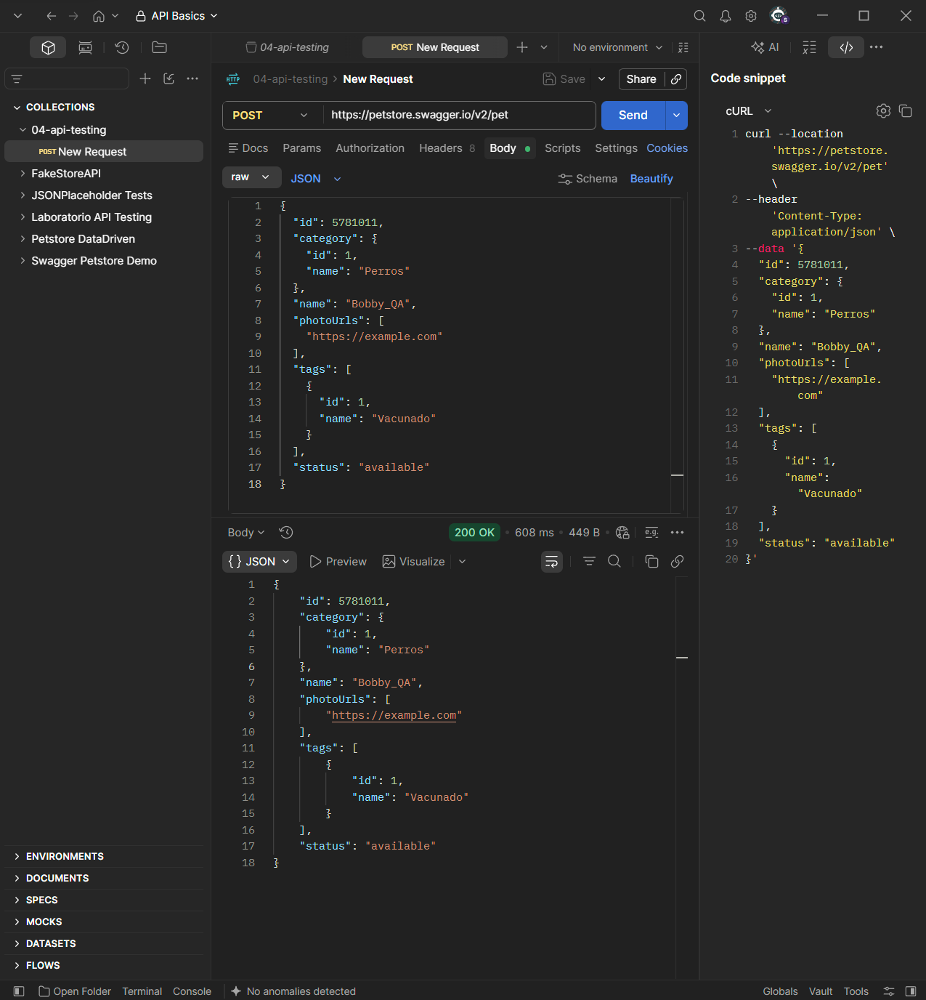
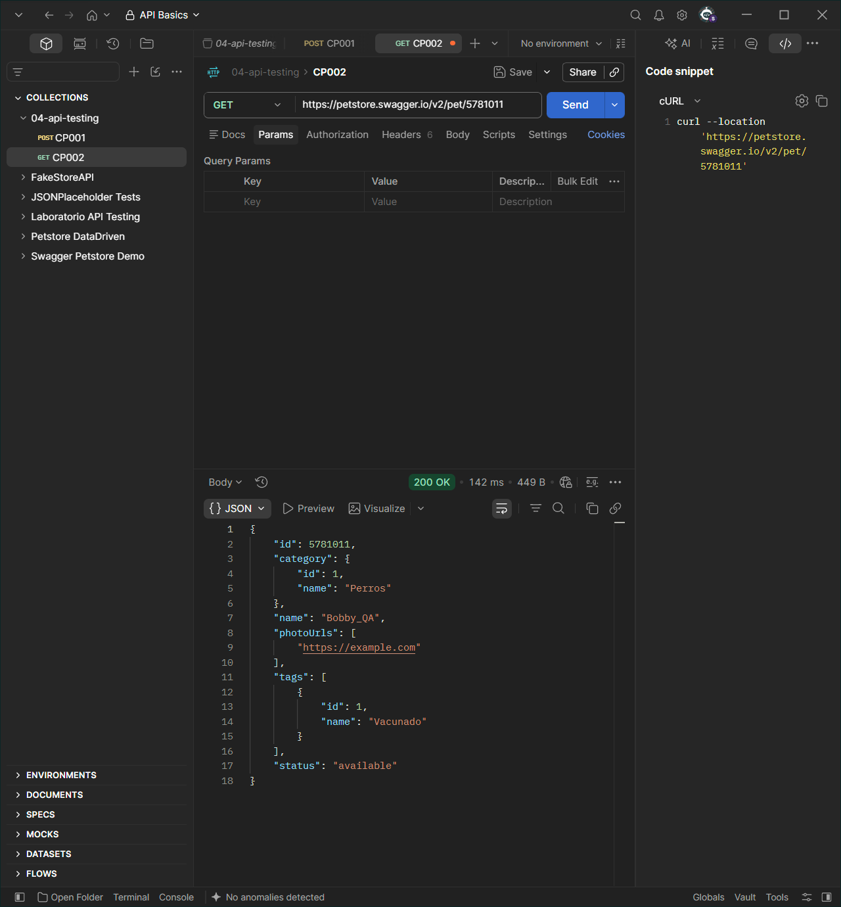
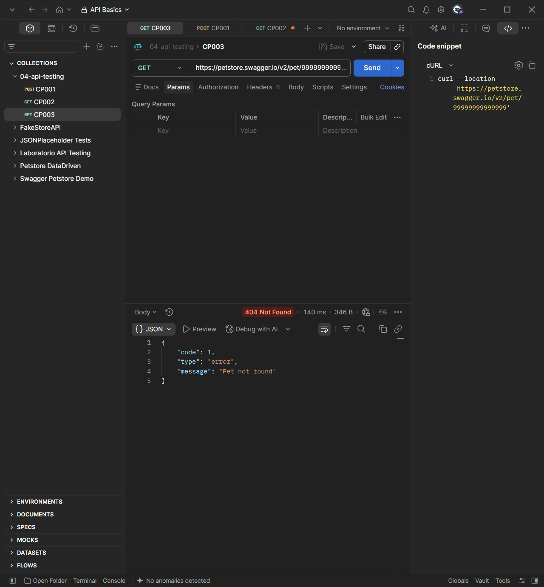
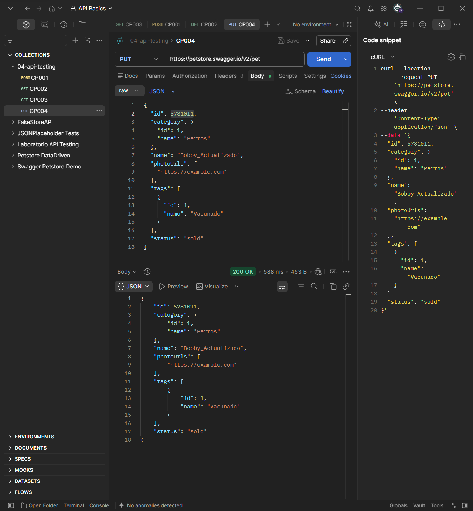
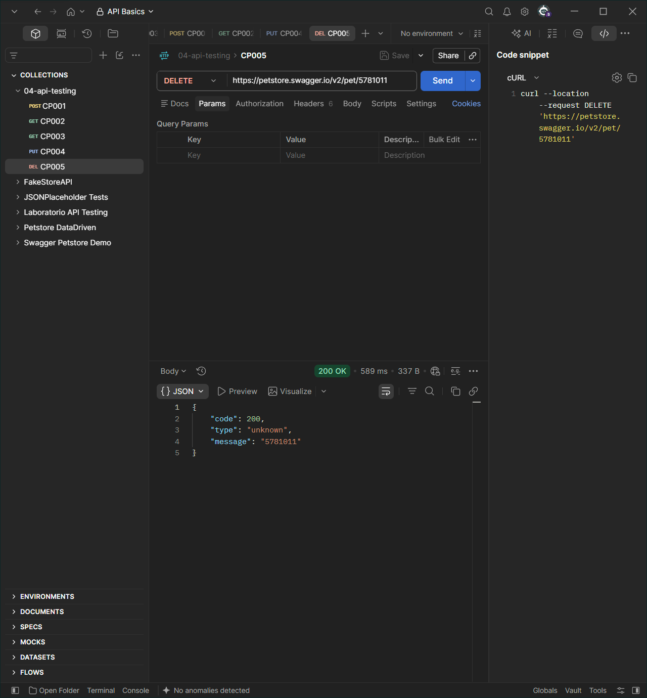

# API Testing - Casos de prueba

## Caso API-01

**Objetivo:** Verificar la adición exitosa de una nueva mascota enviando un cuerpo de solicitud JSON válido.

**Operación y endpoint:** POST `https://petstore.swagger.io/v2/pet`

**Precondiciones:** Ninguna. El entorno público de simulación debe estar accesible.

**Datos de entrada:**
* **Headers:** `Content-Type: application/json`
* **Body:**
```json
{
  "id": 5781011,
  "category": {
    "id": 1,
    "name": "Perros"
  },
  "name": "Bobby_QA",
  "photoUrls": [
    "https://example.com"
  ],
  "tags": [
    {
      "id": 1,
      "name": "Vacunado"
    }
  ],
  "status": "available"
}
```

**Resultado esperado:** Código de estado HTTP `200 OK`. El cuerpo de la respuesta debe devolver el mismo objeto JSON creado conteniendo el ID `5781011`.

**Resultado obtenido:** Código de estado HTTP `200 OK`. El servidor retornó exitosamente la estructura JSON de la mascota creada.

**Evidencia:** 

---

## Caso API-02

**Objetivo:** Validar la obtención correcta de la información de una mascota utilizando un ID existente.

**Operación y endpoint:** GET `https://petstore.swagger.io/v2/pet/5781011`

**Precondiciones:** Haber ejecutado con éxito el Caso API-01 para asegurar la existencia del recurso con ID `5781011`.

**Datos de entrada:** `petId = 5781011` en la URL de la solicitud.

**Resultado esperado:** Código de estado HTTP `200 OK`. El JSON devuelto debe corresponder estrictamente a los datos guardados en el caso anterior, con el nombre `"Bobby_QA"`.

**Resultado obtenido:** Código de estado HTTP `200 OK`. Se recuperó la información exacta solicitada de manera correcta.

**Evidencia:** 

---

## Caso API-03

**Objetivo:** Verificar el comportamiento del sistema ante la búsqueda de una mascota con un identificador inexistente.

**Operación y endpoint:** GET `https://petstore.swagger.io/v2/pet/99999999999999`

**Precondiciones:** Garantizar que el ID ingresado en el endpoint no se encuentre registrado en el servidor.

**Datos de entrada:** `petId = 99999999999999` en la URL de la solicitud.

**Resultado esperado:** Código de estado HTTP `404 Not Found`. El cuerpo de la respuesta debe incluir un mensaje que indique que el recurso no fue encontrado.

**Resultado obtenido:** Código de estado HTTP `404 Not Found`. El servidor manejó el error de forma correcta arrojando un tipo de respuesta controlado.

**Evidencia:** 

---

## Caso API-04

**Objetivo:** Comprobar la actualización exitosa de los datos de una mascota ya existente mediante el método PUT.

**Operación y endpoint:** PUT `https://petstore.swagger.io/v2/pet`

**Precondiciones:** El recurso con ID `5781011` debe existir previamente en el sistema.

**Datos de entrada:**
* **Headers:** `Content-Type: application/json`
* **Body:**
```json
{
  "id": 5781011,
  "category": {
    "id": 1,
    "name": "Perros"
  },
  "name": "Bobby_Actualizado",
  "photoUrls": [
    "https://example.com"
  ],
  "tags": [
    {
      "id": 1,
      "name": "Vacunado"
    }
  ],
  "status": "sold"
}
```

**Resultado esperado:** Código de estado HTTP `200 OK`. El JSON de la respuesta debe reflejar el cambio del campo `name` a `"Bobby_Actualizado"` y el campo `status` a `"sold"`.

**Resultado obtenido:** Código de estado HTTP `200 OK`. Los campos del recurso se actualizaron correctamente sin alterar la integridad de los datos.

**Evidencia:** 

---

## Caso API-05

**Objetivo:** Evaluar la eliminación definitiva de un registro de mascota de la base de datos por medio de su ID.

**Operación y endpoint:** DELETE `https://petstore.swagger.io/v2/pet`

**Precondiciones:** El recurso con ID `5781011` debe encontrarse disponible antes de proceder al borrado.

**Datos de entrada:** `petId = 5781011` en la URL de la solicitud.

**Resultado esperado:** Código de estado HTTP `200 OK`. La respuesta del servidor debe confirmar la remoción definitiva indicando el ID afectado.

**Resultado obtenido:** Código de estado HTTP `200 OK`. Se confirmó de manera satisfactoria la eliminación del registro.

**Evidencia:** 

---

# Conclusiones

## Resultados relevantes
El comportamiento general de la sección `pet` se alinea correctamente con la especificación provista. Las cuatro operaciones clave del ciclo CRUD se ejecutaron exitosamente en condiciones normales, garantizando que el almacenamiento, lectura, actualización y borrado mantienen la persistencia lógica de la información del recurso.

## Limitaciones
Al tratarse de un entorno público y de demostración abierta de Swagger, los datos son altamente volátiles y están sujetos a constantes mutaciones o sobrescrituras por parte de otros usuarios concurrentes. Debido a esta limitación, no fue factible realizar pruebas de aislamiento de datos puras a largo plazo sin el riesgo de experimentar colisiones de IDs.

## Pruebas adicionales
Si se contara con mayor disponibilidad de tiempo, se estructurarían pruebas de contrato automatizadas directamente en la pestaña **Tests** de Postman para validar rigurosamente los esquemas JSON de las respuestas. Adicionalmente, se diseñarían escenarios negativos de inyección de tipos de datos incorrectos (ej. caracteres de texto enviados dentro de campos definidos estrictamente numéricos) para estresar las validaciones del servidor.
